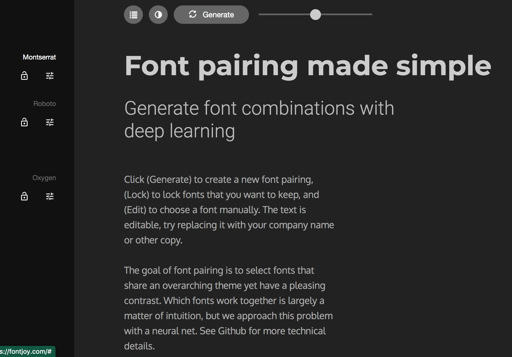

# The Pizza Brothers
---

## **Brief**
The Pizza Brothers website is a business sit for a italian food truck business based in Brighton. The business is a young and growing operation with a local customer base, but the ownes have aspirations of expanding their business and believe that building an online presence will aid them in doing so.

[Link to the live site](https://kippad.github.io/html-css-project/)

---

---

## **UX**

### **Objectives**
The objective of the website from the owner’s perspective is to increase the profile and revenue of their business. The aims of the site therefore are to:

- Develop an online presence that will increase the exposure of the business to more customers.

- Build a professional looking website that will increase the legitimacy or trustworthiness of the business to larger clients such as event and wedding planners, rather than relying on social media pages.

- Allow users to easily find a schedule of appearances and events so that the business can be easily located.

- Build an organized point of contact between the customer and the business by including a contact form for enquiries rather than relying on social media.

### **Target Audience**
The main demographic of the target audience falls into two categories: 

- **Local Customers** - Prospective customers that live in the area. They have recently discovered the food truck, maybe through a google search or through word of mouth, and want to know more about the business before choosing to eat there. Or repeating customers who have used the truck before and want to locate where they can eat there that week.

- **Event Planners** - Corporate event planners, music festivals, weddings, or food courts that are looking to hire the business.

### **Design** 
The design of the Pizza Brothers website aims to satisfy these two target audience demographics:

- **Intuitive navigation** - The user can easily move through the pages and content of the site using the navigation menu and clearly labeled links, making all site actions obvious to a first time user.

- **UX Conventions** - Design follows UX conventions by structuring content in order of its importance. It also ensures that the user is never overloaded with too much information at any given moment.

- **Clean and consistent design** - The design uses consistent fonts and colors throughout the site to maintain the style across the entire website.

### **Color Scheme**

---

The color scheme on the Pizza Brothers was generated with **Coolors**. Bright and overstated colors can easily detract from the other visual elements of the site, so a neutral palette with limited colors was chosen. 

The darker colors were mainly used for the footing and header elements with white text, and the lighter gray used for the main body with dark text. This allowed the page content to be broken up clearly into sections that give the page a balance of contrast.

### Typography

---

The fonts chosen for the Pizza Brothers were identified using Font Joy. This site uses deep learning to pair fonts from the google font library in an aesthetically pleasing way.

The fonts used on the site were: ***Montserrat***, ***Roboto***, and ***Oxygen***.

### **Imagery**
The Pizza Brothers site does not include a great deal of text, instead relying on plenty of images. The reasoning aside from aesthetic purposes is that in most cases presenting a user with delicious pictures of the food will provide all of the information that they need to make a decision to use the service or not.

Whether it is a passer by or an event planner looking to book a caterer, an evaluation will be made by the user on the basis of whether they themselves would choose to eat there. Therefore images are central to the design, with the purpose of enticing customers with appealing photos of food.

Images on the Pizza Brothers site were compiled using: 

1. **Unsplash**
2. **Freepik**
3. **Pexels**
4. **Pixabay**

### **Wireframes**

---

**Balsamiq** was used to wireframe the original design of the Pizza Brothers site on desktop devices. These designs were used as a guide throughout, although the final design did deviate in many ways.

## **Features**
---

### **Current Features**

### **Header and Hero Image**

---

The title and navigation bar allows users to navigate across the site. The hero image provides a basic description of the site on a backdrop of a visually appealing pizza image. 

- **Intuitive Navigation**- It is clear to the user how to move through the site's pages using the navigation bar. 

- **Soft Introduction** - Title and text overlay presents users with introductory information about the site and business without overloading them with information early on, allowing them to see what the business is about before delving further into more detailed content.

- **Enquiries Button** - Quickly directs users to the contact form on the site.

- **Responsive Design** - Responsive styling to maintain usability on different viewport sizes.

### **About Us**

---

The about us section is the main text element of the website and where the user can find general information about the business. 

- **Relevant and digestible information** -  Designed so that a user can easily surmise the key information of the business without having to read a wall of text.

- **Responsive Design** - Responsive styling to different viewport sizes.

**Menu**

---

The menu section provides the user with the products that the Pizza brother sell.

- **Product Information** - The menu section provides the user with a menu and prices of the product. 

- **CSS Accordion** - On tablet and mobile devices the section is broken up into a CSS accordion that allows users to expand and minimize the text information.

- **Responsive Design** - Section breaks into different styles in order to maintain aesthetic.

### **Schedule**

---

The schedule section is a grid of information that tells the user where the Pizza Brothers truck will be situated on any given week. 

- **Weekly Timetable** - The schedule section shows the user where they can find the Pizza Brothers every week.

- **Map and Dates** - The map iframe allows the business owner to update their future schedule on the website on an interactive map. The corresponding date panel shows the same dates in order to allow screen readers to read the information.

- **Responsive Design** - Grid adjusts into panel columns as viewport size decreases.

---

The reviews sections is a collection of testimonials from customers.

- **Responsive Design** - Testimonials adjust to width of viewport size.

### Gallery

---

The gallery page displays various images relating to the business. 

- **Responsive Design** - Images resize to maintain style depending on the viewport sizes.
	
- **Positive Emotional Response** - Images were selected in order to elicit a positive emotional response and convince prospective customers to use the service.

### **Contact**

---

The contact page allows a user to get in touch with the site owner.

- **Contact Form** - A user can use this enquiry form to send a message to the business owner.

- **Thank You Page** - Upon form submission the user is redirected to a thank you page with a button that links them back to the homepage.

- **Responsive Design** - The form style changes in order to maintain its design on different devices.

---

## **Future Features**
Here are some ideas for the future development of the product.

- **Schedule UI** - An interface that allows the site owner to edit the schedule section of the website without having to open the source and edit the html.

- **Recipes/Blog Page** - A page where the site owner can post recipes and updates for users and embed social media posts within the site.

- **Testimonials Carousel** - A slideshow/carousel that displays user reviews individually before scrolling to another.

## **Technology**
The Pizza Brothers Site was built with the following languages and applications.

1. **HTML** - Provides the structure and content of the site.
2. **CSS** - Gives style to the site.
3. **Gitpod** - Used to develop the site.
4. **Github** - Version control and deployment of the site.
5. **Balsamiq** - Used to wireframe the plan of the design.
6. **Font Awesome** - Icon library imported for the site.
7. **Am I Responsive** - Generator used for site images on the readme.

## **Testing**

The testing of the site can be found [**here**](TESTING.md).

## **Deployment**
**To deploy the project:**
The website repository was hosted on Github Pages by doing the following: 

1. Navigate to **github.com**.
2. Locate the desired repository.
3. Navigate to the repository **Settings**.
4. Click **Pages** in the menu on the left of the screen.
5. Using the dropdown in the **Source** section, select Main.
6. Click save and refresh the page and a link to the live site will be presented.

**To clone the project:**
Users can clone the project to develop it further themselves:

1. Within the repository click the **Code** dropdown menu.
2. In the clone section copy the https url.
3. Within the chosen IDE open a **git bash** terminal.
4. Type **git clone**, followed the url. 
5. Run the command and a clone will be created.

## **Credits**
The gallery layout was initially built using a grid with columns that collapsed as the  viewport width decreased. I then stumbled upon this tutorial by Tim Van Damme which showed me how to make an adaptive layout using lists and flexbox.
[Link to tutorial](https://css-tricks.com/adaptive-photo-layout-with-flexbox/)

The accordion feature of the menu section was built with methods learnt using the following resources:

1. [Codepen](https://codepen.io/bilal-pf/pen/eYZrPGW?editors=1100) user **Bilal BF**.

2. [Codepen](https://codepen.io/coding_beast/pen/PoZgYGR) user **Coding Beast**.

3. [Codepen](https://codepen.io/epjuan21/pen/QyELMw) user **Juan Fernando Ramirez**.

## **Acknowledgments**

I want to thank my fellow code institute students for all of the useful troubleshooting and support 
found on the slack.

Also to my mentor Precious Ijegbe for his advice and guidance throughout the project.

