# **The Pizza Brothers**

## **Brief**

The Pizza Brothers website is a business site for an Italian food truck business based in Brighton. The business is a young and growing operation with a local customer base, but the owners have aspirations of expanding their business and believe that building an online presence will aid them in doing so.

[Link to the live site](https://kippad.github.io/html-css-project/)

---

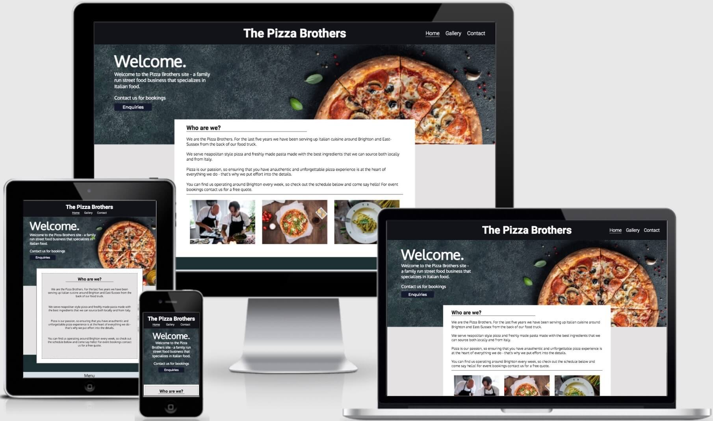

---

## Contents 
- [UX (User Experience)](#ux-user-experience)
    - [Objectives](#objectives)
    - [Target Audience](#target-audience)
- [Design](#design)
    - [Color Scheme](#color-scheme)
    - [Typography](#typography)
    - [Imagery](#imagery)
    - [Wireframes](#wireframes)
- [Features](#features)
    - [Current Features](#current-features)
    - [Future Features](#future-features)
- [Technology](#technology)
- [Testing](#testing)
- [Deployment](#deployment)
    - [To deploy the project](#to-deploy-the-project)
    - [To clone the project](#to-clone-the-project)
- [Credits](#credits)
    - [Code](#code)
    - [Media](#media)
    - [Acknowledgements](#acknowledgments)

---

## **UX (User Experience)**

### **Objectives**
The objective of the website from the perspective of the owner is to increase the profile and revenue of the business. The aims of the site therefore are to:

- Develop an online presence that will increase the exposure of the business to more customers.

- Build a professional looking website that will increase the legitimacy or trustworthiness of the business to larger clients such as event and wedding planners, rather than relying on social media pages.

- Allow users to easily find a schedule of appearances and events so that the business can be easily located.

- Build an easy point of contact between the customer and the business by including a contact form for enquiries rather than relying on social media.

[Back to contents](#contents)

### **Target Audience**
The main demographic of the target audience falls into two categories:  

-  **Local Customers** - Prospective customers that live in the area. Perhaps a first time customer who has found the website through a google search, who wants to know more about the business before choosing to eat there. Or maybe a repeating customer who has used the service before and is interested in checking the site schedule.

-  **Event Planners** - Corporate event planners, music festivals, weddings, or food courts that are looking to hire the business.

[Back to contents](#contents)

## **Design**
The design of the Pizza Brothers website aims to satisfy these two target audience demographics through:

-  **Intuitive Navigation** - The design makes all site actions obvious to a first time user. Navigating through the pages and content of the site is easy and instinctive. 

-  **UX Conventions** - The design follows UX conventions by structuring content in order of its importance. It also ensures that the user is never overloaded with too much information at any given moment.

-  **Clean and Consistent Design** - The design uses consistent fonts and colors to maintain the style across the entire website.

[Back to contents](#contents)

### **Color Scheme**
---
  

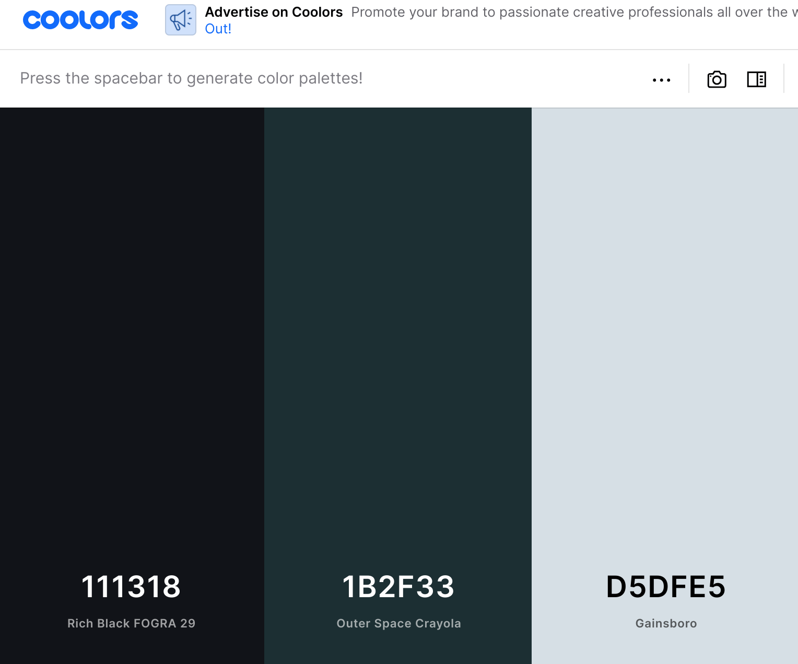

The color scheme on the Pizza Brothers was generated with [**Coolors**](https://coolors.co/). Bright and overstated colors can distract from the other visual elements, so a neutral palette with limited colors was chosen.

The darker colors were mainly used for the footing and header elements with white text, and the lighter gray used for the main body with dark text. This allowed the page content to be broken up clearly into sections that give the page a balance of contrast.

[Back to contents](#contents)

### **Typography**
---

The fonts chosen for the Pizza Brothers were identified using [**Fontjoy**](https://fontjoy.com/). This site uses deep learning to pair fonts from the google font library in an aesthetically pleasing way.

The fonts used on the site were: ***Montserrat***, ***Roboto***, and ***Oxygen***.

[Back to contents](#contents)

### **Imagery**
The Pizza Brothers site does not include a great deal of text, instead relying on plenty of images. The reasoning aside from aesthetic purposes is that in most cases presenting a user with delicious pictures of the food will provide them with all of the information that they need to make a decision on whether to use the service or not.

Whether it is a passer by or an event planner looking to book a caterer, an evaluation will be made by the user on the basis of whether they themselves would choose to eat there. Therefore images are central to the design, with the purpose of enticing customers with appealing photos of food.
  
[Back to contents](#contents)
 
### **Wireframes**
---

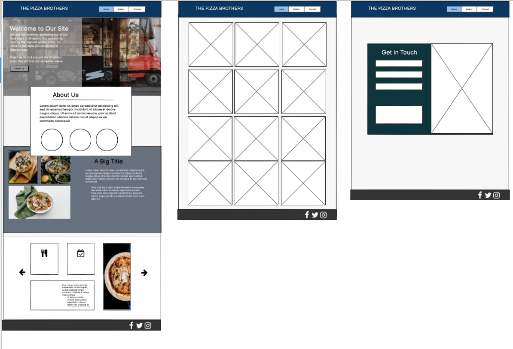

**Balsamiq** was used to wireframe the original design of the Pizza Brothers site on desktop devices. These designs were used as a guide throughout, although the final design did deviate in many ways.

[Back to contents](#contents)

## Features

### **Current Features**
---

### **Header and Hero Image**

---

 

The title and navigation bar allows users to navigate across the site. The hero image provides a basic description of the site on a backdrop of a visually appealing pizza image.

-  **Intuitive Navigation** - It is clear to the user how to move through the site's pages using the navigation bar.

- **Fixed Header** - The header is fixed to the screen, allowing a user to initiate actions from anywhere on the site.

- **Active Class** - A border is shown under the navigation link of the active page to show the user where they are on the site at all times. 

-  **Soft Introduction** - The title and text overlay presents users with introductory information about the site and business without overloading them with information early on, allowing them to see what the business is about before delving further into more detailed content.

-  **Enquiries Button** - Quickly directs users to the contact form on the site.

-  **Responsive Design** - Responsive styling to maintain aesthetic on different viewport sizes. 

### **About Us**
---

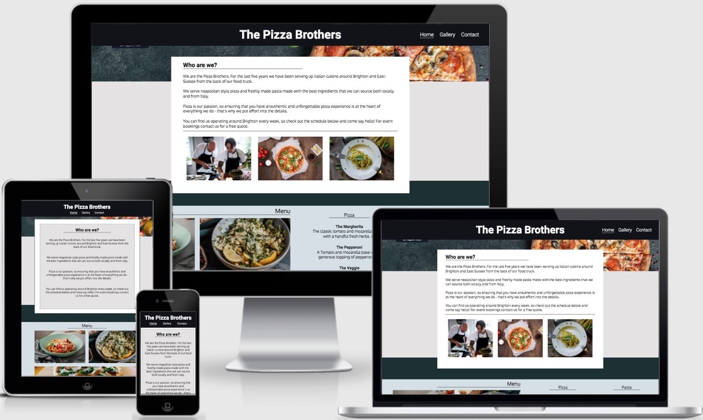

The about us section is the main text element of the website and where the user can find general information about the business.

-  **Relevant and Digestible Information** - Designed so that a user can easily surmise the key information of the business without having to read a wall of text.

-  **Responsive Design** - Responsive styling to different viewport sizes.

**Menu**
---

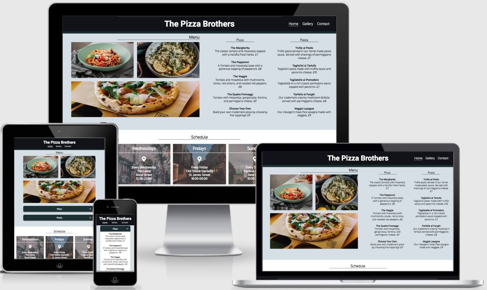

The menu section provides the user with the products that the Pizza Brothers sell. 

-  **Product Information** - The menu section provides the user with the menu and prices of the product.

-  **CSS Accordion** - On tablet and mobile devices the section is broken up into a CSS accordion that allows users to expand and minimize the text information.

-  **Responsive Design** - Section maintains aesthetic through responsive styling.

### **Schedule**
---

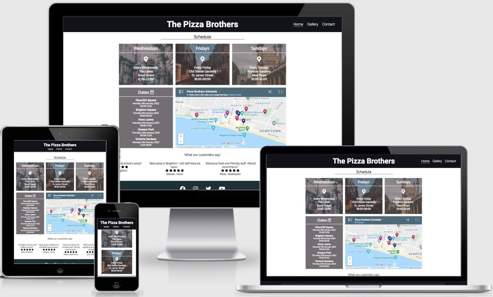

The schedule section is a grid of information that tells the user where the Pizza Brothers truck will be situated on any given week.

-  **Weekly Timetable** - The schedule section shows the user where they can find the Pizza Brothers every week.

-  **Map and Dates** - The map iframe allows the business owner to update their future schedule on the website on an interactive map. The corresponding date panel shows the same dates in order to allow screen readers to read the information.

-  **Responsive Design** - Grid changes into a column of panels as viewport size decreases.

### **Reviews**
---

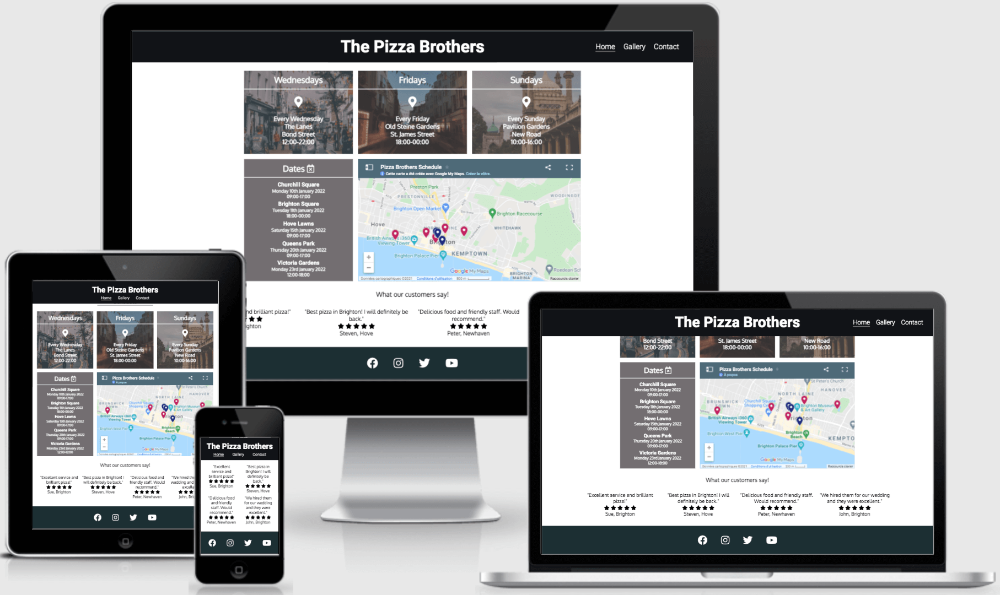

The reviews sections is a collection of testimonials from customers.

-  **Responsive Design** - Testimonials adjust to width of viewport size.

### Gallery
---

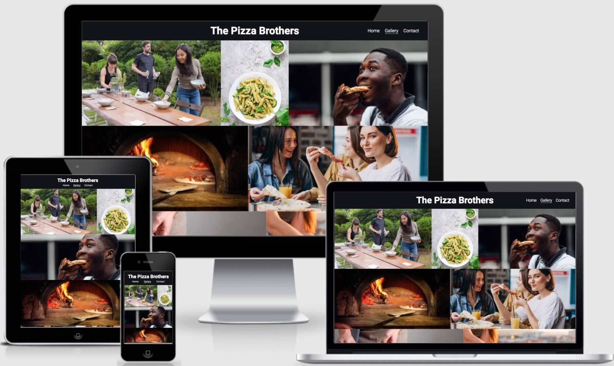
 

The gallery page displays various images relating to the business.

-  **Responsive Design** - Images resize to maintain style irrespective of the viewport size.

-  **Positive Emotional Response** - Images were selected in order to elicit a positive emotional response and convince prospective customers to use the service.

### **Contact**

---  

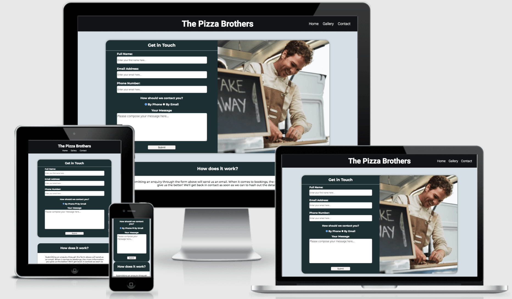

The contact page allows a user to get in touch with the site owner.

-  **Contact Form** - A user can use this enquiry form to send a message to the business owner.

-  **Thank You Page** - Upon form submission the user is redirected to a thank you page with a button that links them back to the homepage.

-  **Responsive Design** - The form style changes in order to maintain its design on different devices.
 
[Back to contents](#contents)

### **Future Features**
---

Here are some ideas for the future development of the product.

-  **Schedule UI** - An interface that allows the site owner to edit the schedule section of the website without having to open the source and edit the html.
  
-  **Recipes/Blog Page** - A page where the site owner can post recipes and updates for users and embed social media posts within the site.

-  **Testimonials Carousel** - A slideshow/carousel that displays user reviews individually before scrolling to another.

[Back to contents](#contents)

## **Technology** 
The Pizza Brothers Site was built with the following languages and applications.

1.  [**HTML**](https://en.wikipedia.org/wiki/HTML5) - Provides the structure and content of the site.
2.  [**CSS**](https://en.wikipedia.org/wiki/CSS) - Gives style to the site.
3.  [**Gitpod**](https://gitpod.io) - Used to develop the site.
4.  [**Github**](https://github.com) - Version control and deployment of the site.
5.  [**Codepen**](https://codepen.io) - Used to design features before implementation.
6.  [**Balsamiq**](https://balsamiq.com/) - Used to wireframe the plan of the design.
7.  [**Font Awesome**](https://fontawesome.com/) - Icon library imported to the site.
8.  [**Am I Responsive**](http://ami.responsivedesign.is/) - Generator used for site images on the readme.
9.  [**Coolors**](https://coolors.co/) - For generating colour palette.
10. [**Fontjoy**](https://fontjoy.com/) - For generating font pairings.

[Back to contents](#contents)

## **Testing**
The testing of the site can be found [**here**](TESTING.md)

[Back to contents](#contents)

## **Deployment**

### **To deploy the project**

The website was hosted on Github Pages by doing the following: 

1. Navigate to **github.com** and locate the desired repository.
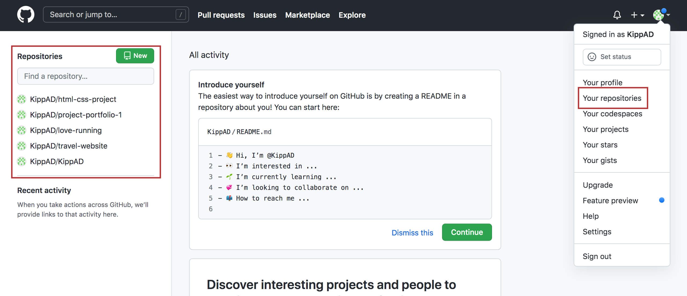

3. Navigate to the repository **Settings**.
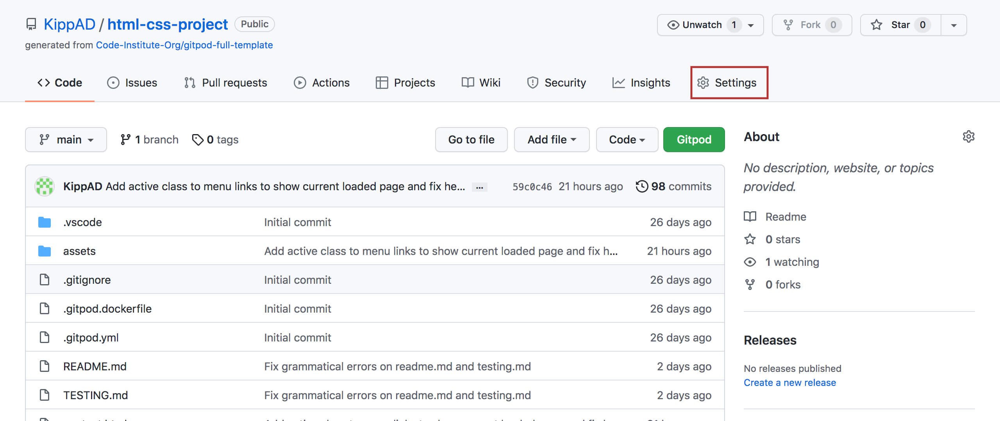

4. Click **Pages** in the menu on the left of the screen.
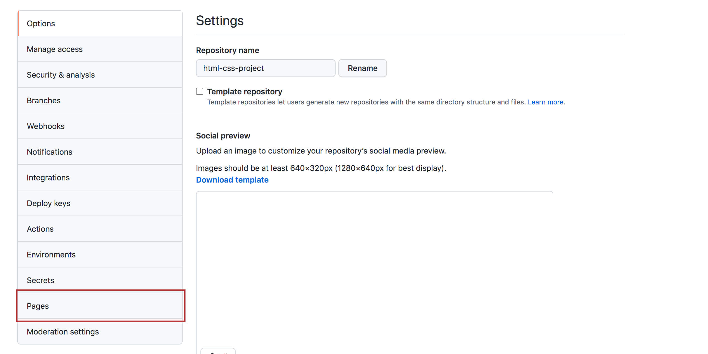

5. Using the **Branch** dropdown in the **Source** section, select **Main**.
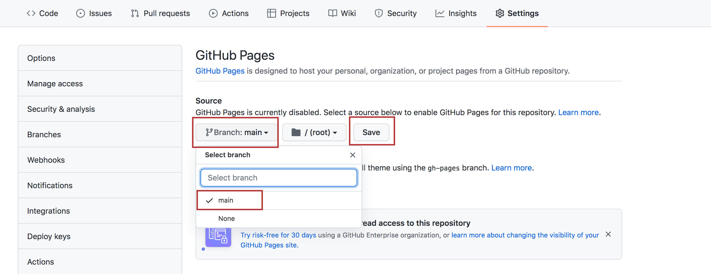

6. Click **Save** and refresh the page. A link to the live site will then be presented.
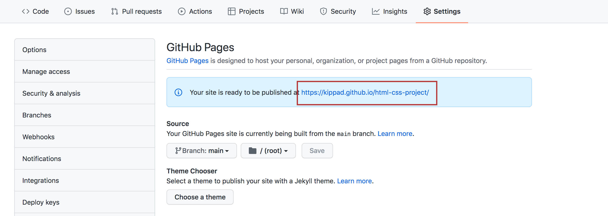

[Back to contents](#contents)

### **To clone the project**

Users can clone the project to develop it further themselves:

1. Within the repository click the **Code** dropdown menu.
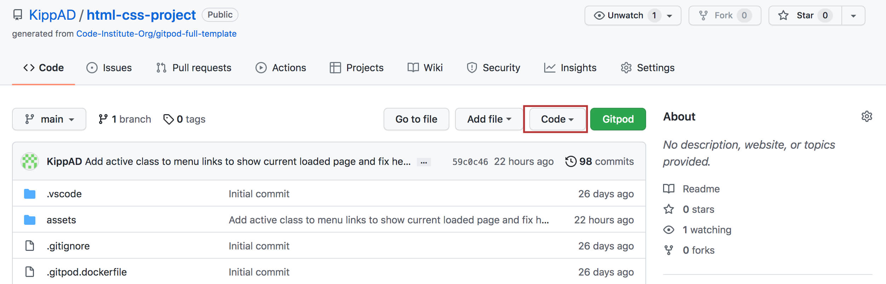

2. In the **Clone** section copy the **https url**.
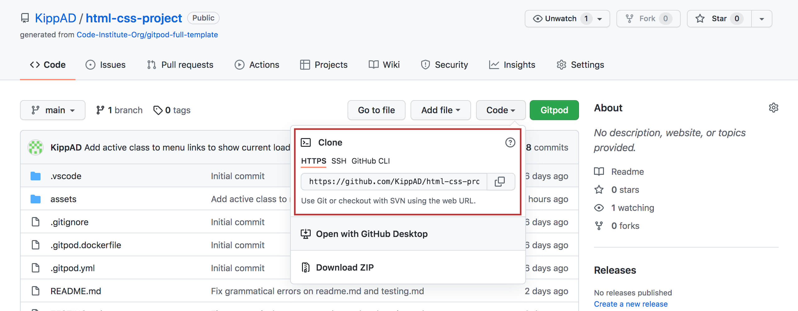

3. Within the chosen IDE open a **git bash** terminal and type **git clone** followed by the url.
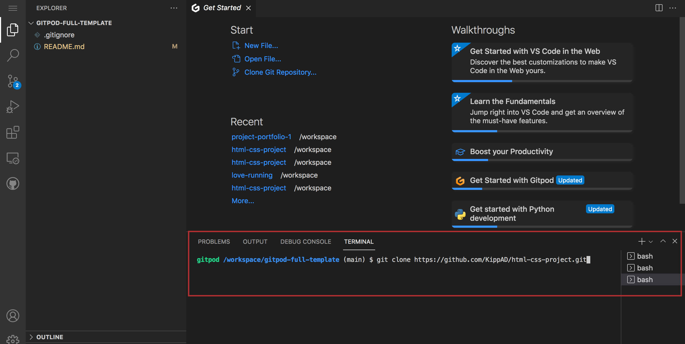

5. Run the command and a clone of the repository will be created in the IDE.
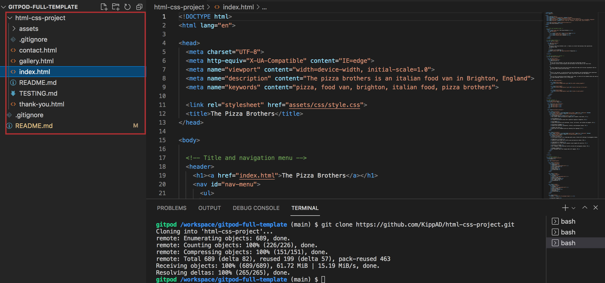

[Back to contents](#contents)

## **Credits**

### Code
The gallery layout was initially built using a grid of equally sized boxes, with the count of columns decreasing as the viewport width decreased. The final design was built after reading this tutorial by **Tim Van Damme**, which details how to make an adaptive layout using lists and flexbox.

[Link to tutorial](https://css-tricks.com/adaptive-photo-layout-with-flexbox/)

The accordion feature of the menu section was built with methods learnt using the following resources:

1.  [Codepen](https://codepen.io/bilal-pf/pen/eYZrPGW?editors=1100) user **Bilal BF**.

2.  [Codepen](https://codepen.io/coding_beast/pen/PoZgYGR) user **Coding Beast**.

3.  [Codepen](https://codepen.io/epjuan21/pen/QyELMw) user **Juan Fernando Ramirez**.

[Back to contents](#contents)

### **Media**

Images on this site were compiled using [**Freepik**](https://www.freepik.com/home), [**Unsplash**](https://unsplash.com/s/photos/food-truck), and [**Pexels**](https://www.pexels.com/search/pizza/).

#### **Index.html Images**
- [Hero Pizza](https://www.freepik.com/premium-photo/tasty-pepperoni-pizza-with-mushrooms-olives_4210238.htm#query=tasty%20pepperoni%20pizza&position=16&from_view=search) by [Vasiliy Budarin](https://www.freepik.com/vasiliybudarin) 

**Who are we?**
- [Chef Image](https://www.pexels.com/photo/two-men-preparing-food-3217156/) by [Rene Asmussen](https://www.pexels.com/@reneasmussen) 
- [Pizza Image](https://www.freepik.com/premium-photo/top-view-arugula-pizza-white-background_8660851.htm#&position=25&from_view=detail#&position=25&from_view=detail) by [Freepik](https://www.freepik.com/) 
- [Pasta Image](https://www.pexels.com/photo/pasta-with-parmesan-1256875/) by [LGH_9](https://www.pexels.com/@lgh_9-324057) 

**Menu**
- [Pasta Image](https://www.pexels.com/photo/delicious-spaghetti-with-bolognese-sauce-and-parmesan-cheese-7218637/) by [Monica Turlui](https://www.pexels.com/@monica-turlui-36421873)
- [Pasta Image](https://www.pexels.com/photo/a-pasta-in-a-bowl-6541815/) by [Alesia Kozik](https://www.pexels.com/@alesiakozik)
- [Pizza Image](https://www.pexels.com/photo/cooked-pizza-1146760/) by [Kristina Paukshtite](https://www.pexels.com/@kpaukshtite)

**Schedule**
- [Lanes Image](https://unsplash.com/photos/LPK5JZY7JOM) by [Evgeny Klimenchenko](https://unsplash.com/@dzheky)
- [Old Steine Image](https://unsplash.com/photos/JvzCNQNHjzk) by [Max Anz](https://unsplash.com/@max_anz)
- [Pavilion Image](https://www.pexels.com/photo/brown-concrete-building-under-white-clouds-3224112/) by [Hert Niks](https://www.pexels.com/@hertwashere)

#### **Gallery.html Images**
- [Customers Image](https://www.freepik.com/free-photo/positive-people-serving-table-with-plates-outdoors_4998626.htm#&position=35&from_view=user) by [Katemangostar](https://www.freepik.com/katemangostar)
- [Pasta Image](https://www.freepik.com/free-photo/penne-pasta-with-pesto-sauce-zucchini-green-peas-basil-italian-food-top-view-flat-lay_7676329.htm#&position=5&from_view=user#position=2) by [Timolina](https://www.freepik.com/timolina)
- [Customers Image](https://www.freepik.com/free-photo/hungry-african-man-eats-pizza-street-close-up_18348682.htm#&position=39&from_view=user) by [Artursafronovvvv](https://www.freepik.com/artursafronovvvv)
- [Pizza Oven Image](https://www.freepik.com/premium-photo/baked-tasty-margherita-pizza-getting-out-oven_4356724.htm#&position=23&from_view=user) by [Antonio Gravante](https://www.freepik.com/antoniogravante)
- [Customers Image](https://www.freepik.com/free-photo/three-girl-friends-having-pizza-bar_6640219.htm#&position=0&from_view=user) by [Senivpetro](https://www.freepik.com/senivpetro)
- [Pizza Image](https://www.freepik.com/free-photo/man-putting-mozzarella-baked-pizza-dough-with-smoked-salmon-slices_11522676.htm#&position=2&from_view=user) by [Freepik](https://www.freepik.com/freepik)
- [Customers Image](https://www.freepik.com/free-photo/woman-eating-pizza-outdoors_10891139.htm#&position=37&from_view=user) by [Freepik](https://www.freepik.com/freepik)
- [Pizza Image](https://www.freepik.com/premium-photo/stone-oven-made-homemade-sourdough-pizza-margherita_18485236.htm#&position=21&from_view=user#position=10) by [Mr Music](https://www.freepik.com/mr-music)
- [Pasta Image](https://www.freepik.com/premium-photo/whole-wheat-tagliolini-with-mushrooms-porcini_20581905.htm#query=tagliolini&position=22&from_view=search) by [user11694906](https://www.freepik.com/user11694906)
- [Pizza Image](https://unsplash.com/photos/cC0_UO1Obg4) by [Louis Hansel](https://unsplash.com/@louishansel)
- [Chef Image](https://www.freepik.com/premium-photo/happy-young-man-preparing-take-away-food-inside-food-truck-focus-hands_16843475.htm#&position=31&from_view=user) by [Disobeyart](https://www.freepik.com/disobeyart)
- [Pizza Image](https://www.pexels.com/photo/selective-focus-photo-of-pizza-in-furnace-3343622/) by [Arthur Brognoli](https://www.pexels.com/@arthurbrognoli)
- [Pizza Image](https://www.freepik.com/free-photo/delicious-neapolitan-pizza-board-with-cherry-tomatoes-free-space-text_7993376.htm#&position=25&from_view=user#position=12) by [Pressahotkey](https://www.freepik.com/pressahotkey)
- [Customers Image](https://www.freepik.com/free-photo/three-firends-together-eating-pizza-cafe_12178515.htm#&position=27&from_view=user#position=13) by [Senivpetro](https://www.freepik.com/senivpetro)
- [Pasta Image](https://www.freepik.com/free-photo/serving-homemade-pappardelle-pasta-with-mushrooms-parmesan-cheese_15848647.htm#&position=9&from_view=user#position=4) by [Rawpixel](https://www.freepik.com/rawpixel-com)
- [Pizza Image](https://www.pexels.com/photo/photo-of-a-person-putting-basil-leaves-on-a-pizza-10068752/) by [Rene Strgar](https://www.pexels.com/@rene-strgar-128710319)
- [Friends Celebrating Image](https://www.freepik.com/free-photo/happy-friends-are-having-beer-barbecue-party-sunny-day_10583048.htm#&position=19&from_view=user#position=9) by [Master1305](https://www.freepik.com/master1305)
- [Pizza Oven Image](https://www.freepik.com/premium-photo/pizza-margherita-wood-oven_4555773.htm#&position=19&from_view=user#position=9) by [Antonio Gravante](https://www.freepik.com/antoniogravante)

##### **Contact.html Images**
- [Chef Image](https://www.freepik.com/premium-photo/happy-young-man-preparing-take-away-food-inside-food-truck-focus-man-face_16150163.htm#&position=29&from_view=user) by [Disobeyart](https://www.freepik.com/disobeyart)

#### **Thank-you.html images**
- [Background Image](https://unsplash.com/photos/0rDxfwxsVVg) by [Rhys Kentish](https://unsplash.com/@rhyskentish)

[Back to contents](#contents)

### **Acknowledgments**  
I want to thank my fellow code institute students for all of the useful troubleshooting and support found on the slack.

Also to my mentor Precious Ijege for his invaluable advice and guidance throughout the project.

[Back to contents](#contents)
