# **Testing**

## **HTML**
The Pizza Brothers site code has been tested using the W3C HTML Validator and the W3C CSS Validator. 

**Index.html** - There were originally 20 errors which included unclosed tags and incorrect button syntax, but all were resolved: 

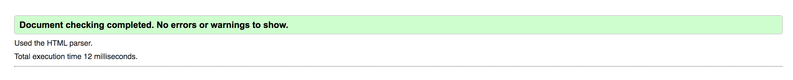

**Gallery.html** - There was a single error from the gallery.html validator check, which was a warning that the page lacked a heading. This was an intentional aesthetic decision, so the warning remains in place:

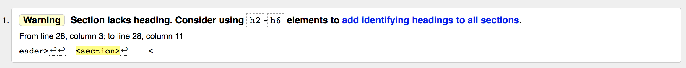

**Contact.html** - There were originally three errors on the gallery.html file that originated from giving the attributes of the phone number input the incorrect values. All were resolved:

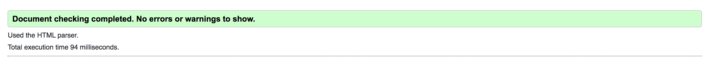

**Thank-you.html** - The thank you page did not return any errors or warnings:

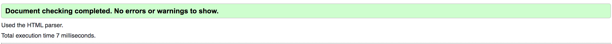

## **CSS**

The CSS validator initially showed two warnings and two errors:

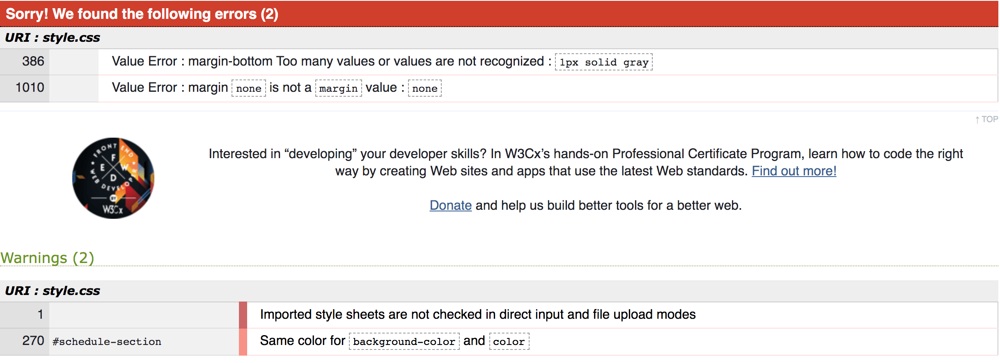

These issues were resolved: 

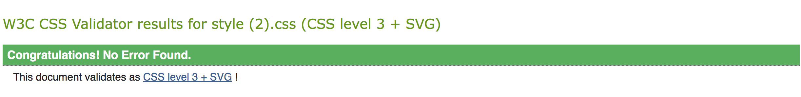

## **Responsiveness**

The Pizza Brothers site responsiveness to different screen sizes was tested using chrome dev-tools. The end results can be seen in the following photos:

### **Header/Hero Image**
---

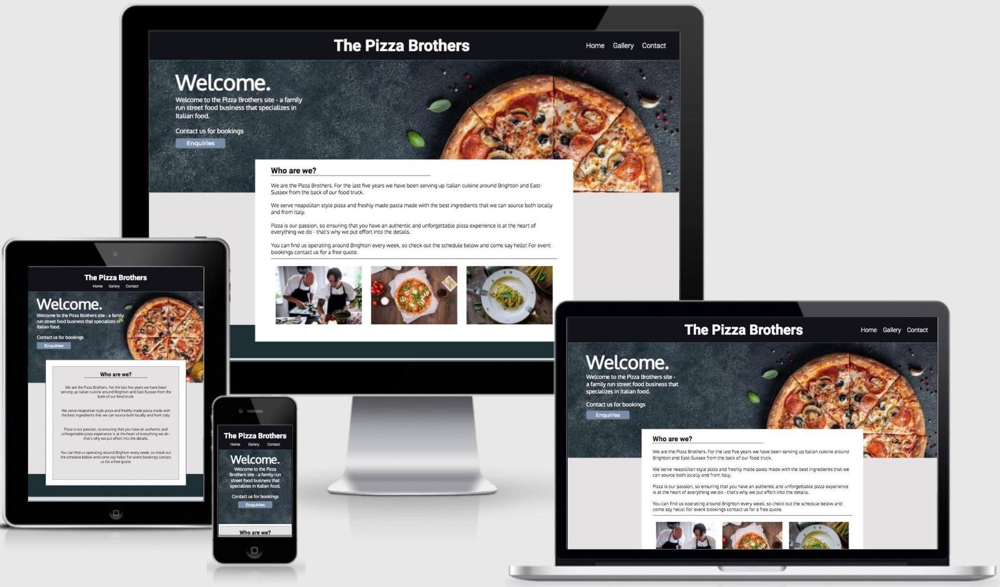

- Navigation-menu drops beneath the title on smaller devices.
- Hero image responsive to screen size.
- Text overlay centers on mobile devices.

### **About Us**
---

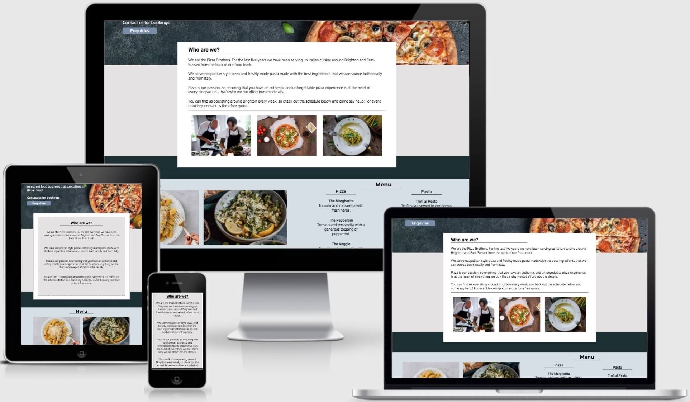

- Images responsive until tablet sized viewports, where they are removed from the display.
- Text panel expands on smaller devices to maintain readability.

### **Menu**
---

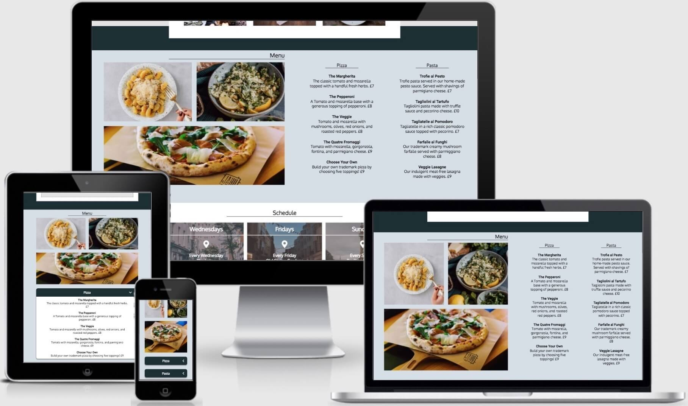

- Menu adjusts changes from side by side to stack on top one another on smaller laptop devices.
- Becomes accordion on tablet and smaller devices, with text dropping down upon the box being clicked and an animated arrow rotating 90 degrees.

### **Schedule**
---

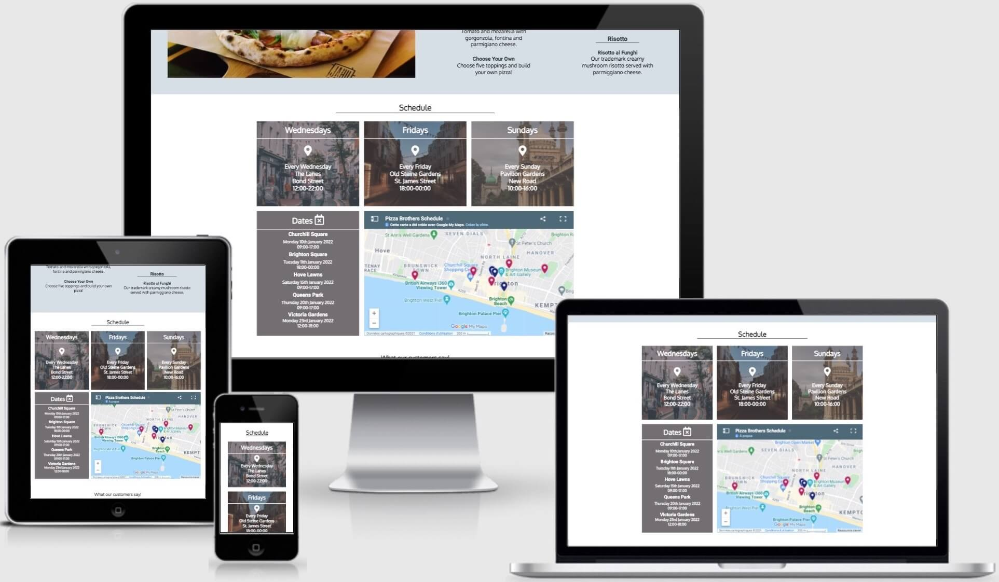

- The schedule section increases its width on different viewport sizes.
- The grid breaks down into single panels on mobile devices.

### **Reviews**
---

- The reviews area increases width on smaller screen sizes.
- It forms a grid on mobile devices.

### **Footer**
---

- The footer retains its style across all screen sizes.

## **Gallery**
---

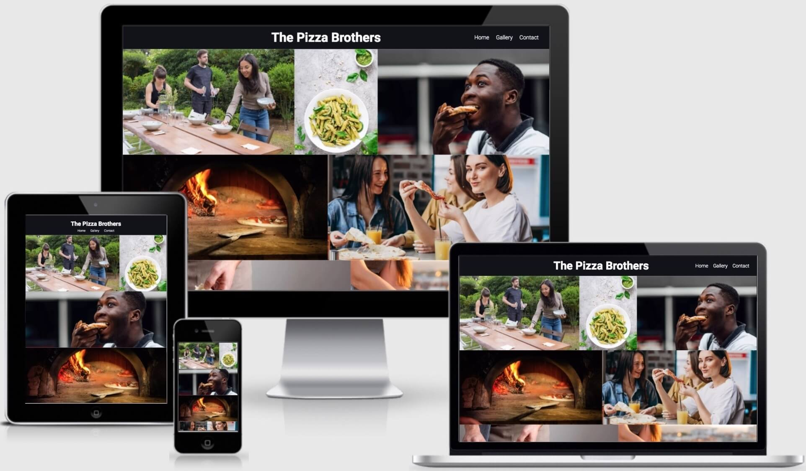

- The gallery uses a responsive flex layout that adjusts the amount of images on each line depending on the viewport size.

## **Contact**
---

- The contact form width increases on smaller screen sizes.
- The image on the right side of the panel disappears on smaller devices and the contact form takes up the whole area.

## **Thank You Page**
---

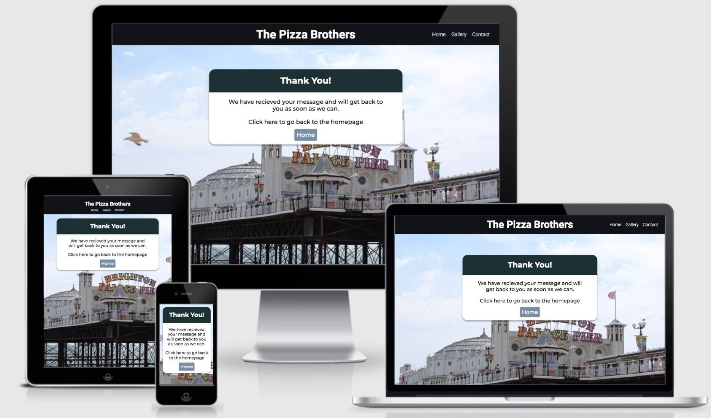

- Panel width increases to fill smaller viewport widths.
- Image is responsive and covers different viewports.

### **Browser Compatibility** 

The Pizza Brothers website browser compatibility has been tested with Google Chrome, Mozilla Firefox, Safari, Opera and there are no issues. This process was done by using each browser's respective developer tools to check each page of the site in every viewport.

Initially, safari seemed to have the greatest amount of issues with the Pizza Brothers Site. It wouldn’t accept webp format images, which meant it was necessary to move back to jpg images. The images eventually loaded in jpg format, but at the expense of some performance. 

## **Lighthouse Testing**

**<h3 align="center">Index.html</h3>**

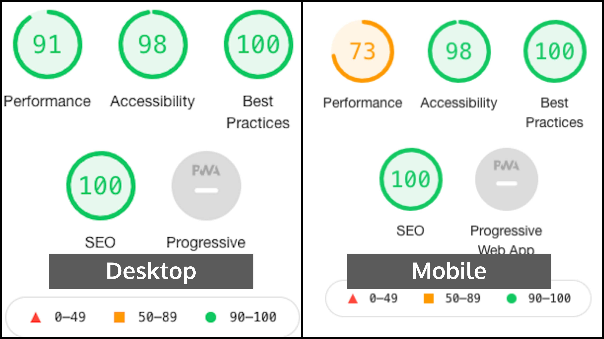

**<h3 align="center">Gallery.html</h3>**

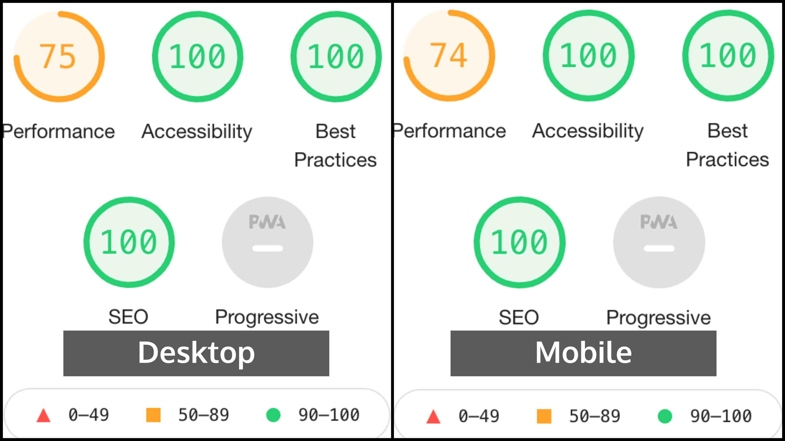

**<h3 align="center">Contact.html</h3>**

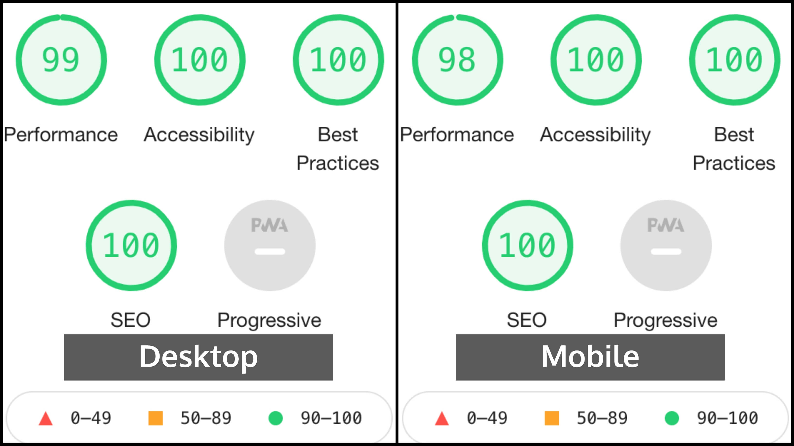

**<h3 align="center">Thankyou.html</h3>**

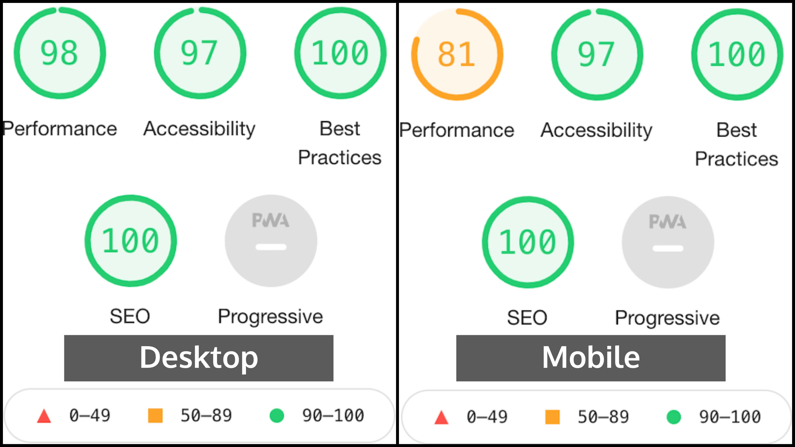

The index page required improvements after the initial lighthouse testing. Namely to accessibility and performance; the accessibility was resolved by improving color contrast on certain elements, adding aria labels to the accordion feature, and the performance was improved by reducing the size of certain images. The gallery similarly was struggling with its performance, which required image size adjustment.

The performance across the site is markedly worse on mobile devices on the index and gallery pages. The issue appears to stem from the server cache policy. This is an issue which with the current technology that the site employs, can not be improved. 

The analytics also suggest converting images into webp formats to improve performance, but this would have affected the site's compatibility with safari.

## **Bugs**

### **Resolved**

### **Unresolved**

**Accordion Animation** - Due to the nature of the accordion code in the menu section, the transition seems like it is appearing from the wrong direction. Fixing this would require completely changing the accordion code.

**Site Performance** - The lighthouse report showed a bad performance score on certain pages. 
