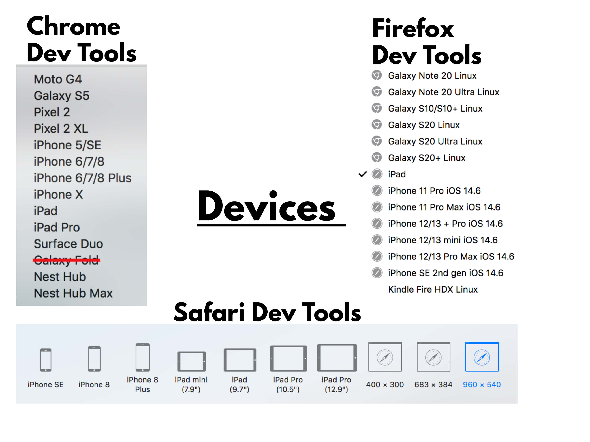
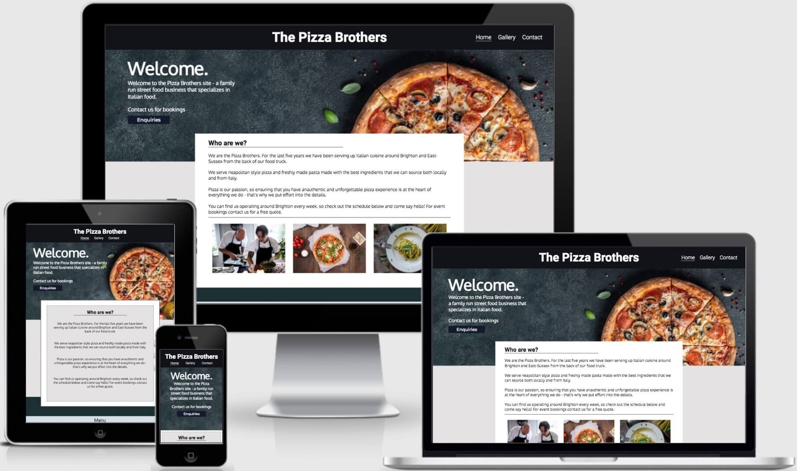
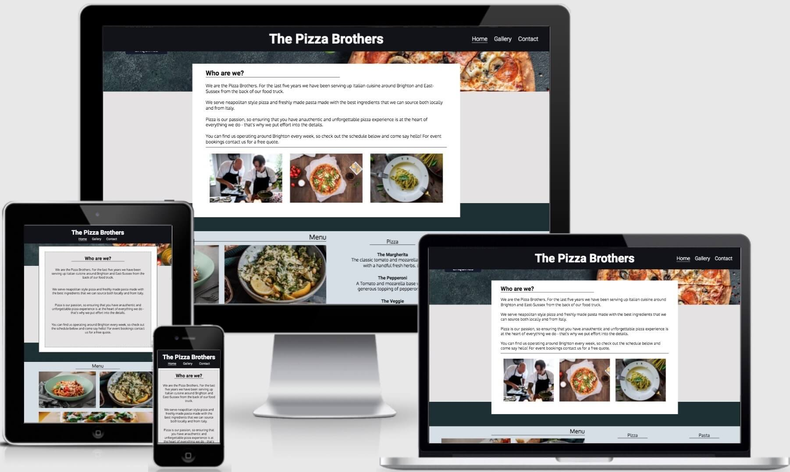
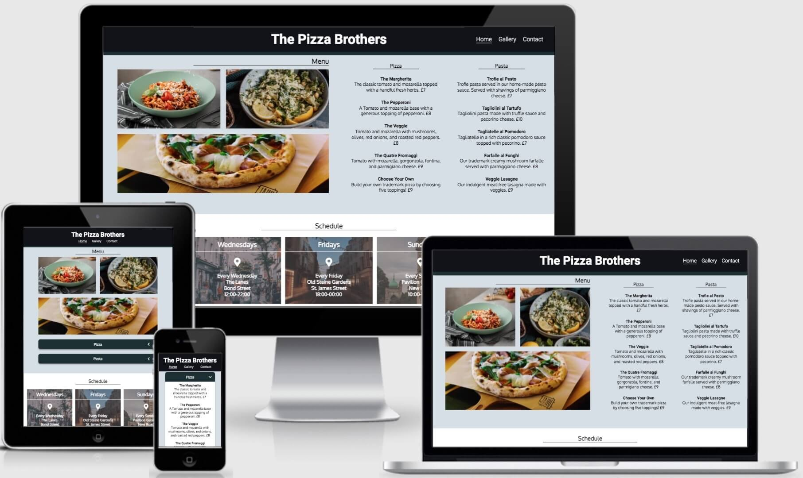
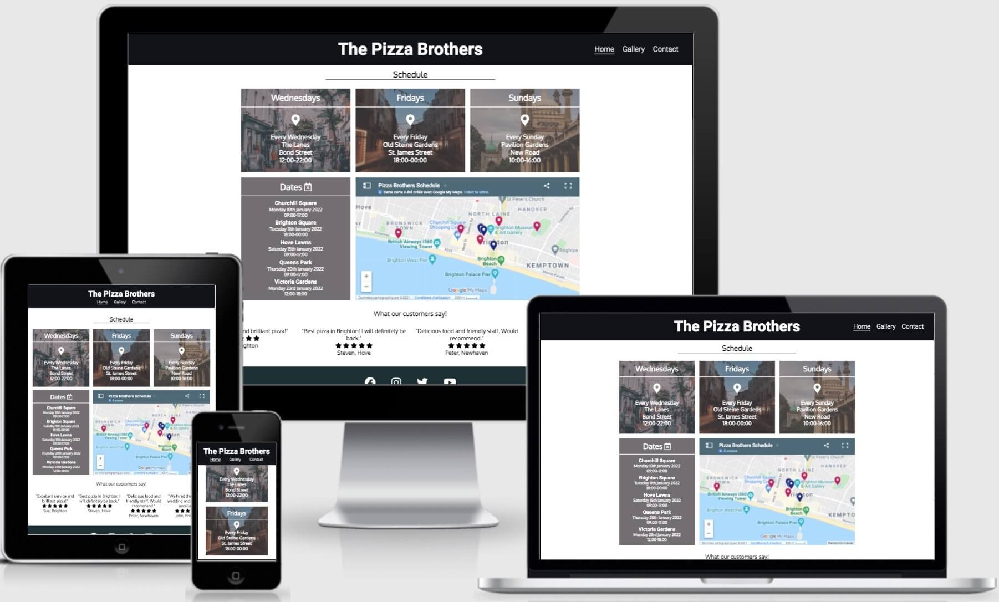
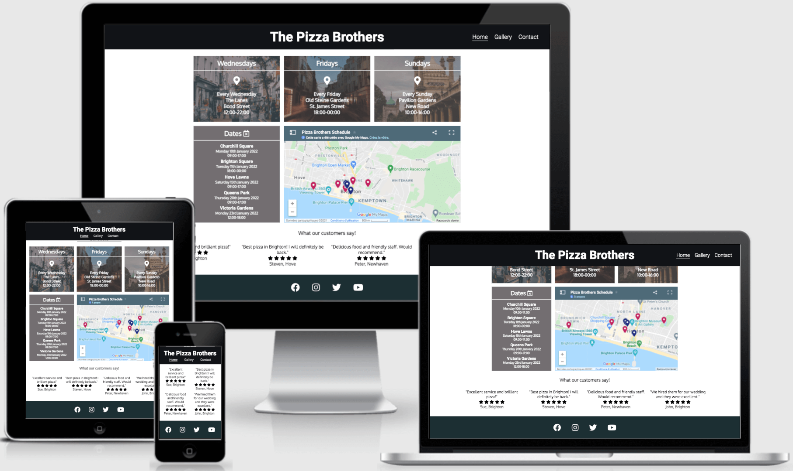
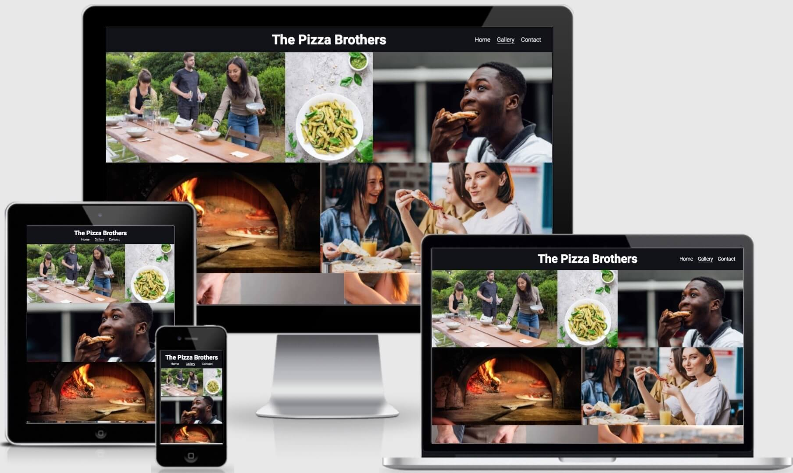
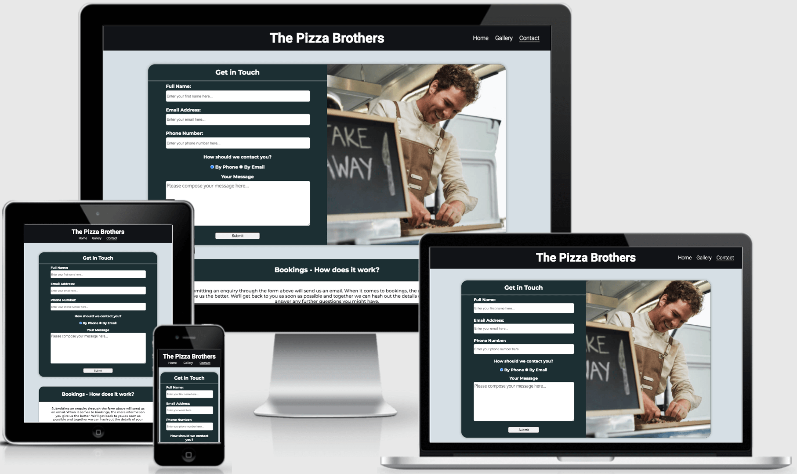
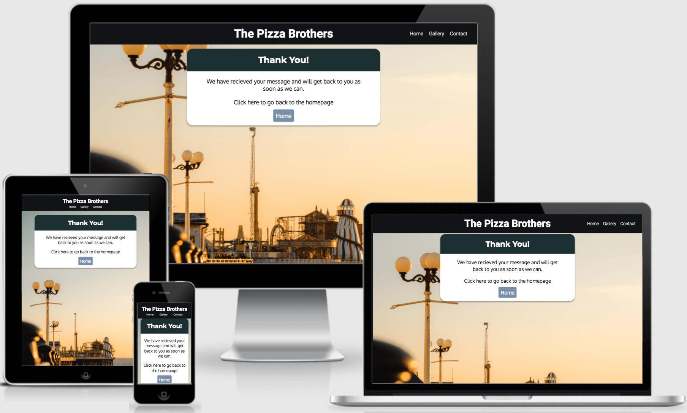

# **Testing**

## Validator Tests

## **HTML W3C Validator**
The Pizza Brothers site code has been tested using the W3C HTML Validator and the W3C CSS Validator. 

**Index.html** - There are no outstanding errors or warnings in the index validator results.

**Gallery.html** - There is a single error from the gallery.html validator check. This is a warning that the page lacked a heading, however this is intentional, so the warning remains in place:

**Contact.html** - There were originally three errors on the gallery.html file that originated from giving the attributes of the phone number input the incorrect values. All were resolved:

**Thank-you.html** - The thank you page did not return any errors or warnings:

## **CSS Jigsaw Validator**

The CSS validator results:

## **Responsiveness**

The Pizza Brothers site responsiveness to different screen sizes was tested using each of chrome, safari, and firefox's respective dev-tools. The preset device dimensions included in each browsers dev tools were especially useful for simulating the sites responsiveness to specific tablet and mobile devices.

These devices can be seen below:

Similarly, dev tools allowed the responsiveness of the site to be tested on larger viewports such as desktop and laptop screen sizes by manually entering the dimensions in responsive mode.

The responsive design across various viewports can be seen below.

### **Header/Hero Image**
---

- Navigation menu drops beneath the title on smaller devices.
- Navigation menu fixed to viewport across all screen sizes.
- Hero image responsive to screen size.
- Text overlay centers on mobile devices.

### **About Us**
---

- Images responsive until tablet sized viewports, where they are removed from the display.
- Text panel expands on smaller devices to maintain readability.

### **Menu**
---

- Menu section stacks to maintain readability on smaller laptop devices.
- Becomes accordion on tablet and smaller devices, with text disappearing into a container which can then be opened by the user.

### **Schedule**
---

- The schedule section increases its width on different viewport sizes.
- The grid breaks down into single panels on mobile devices.

### **Reviews**
---

- The reviews area increases width on smaller screen sizes.
- It forms a grid on mobile devices.

### **Footer**
---

- The footer retains its style across all screen sizes.

## **Gallery**
---

- The gallery uses a responsive flex layout that adjusts the amount of images on each line depending on the viewport size.

## **Contact**
---

- The contact form width increases on smaller screen sizes.
- The image on the right side of the panel disappears on smaller devices and the contact form takes up the whole area.

## **Thank You Page**
---

- Panel width increases to fill smaller viewport widths.
- Image is responsive and covers different viewports.

### **Browser Compatibility** 

The Pizza Brothers website has been tested on Google Chrome, Mozilla Firefox, Safari, and Opera. This process was done by using each browser's respective developer tools to check each page of the site in every viewport.

Initially, safari seemed to have the greatest amount of issues with the Pizza Brothers Site. It wouldn’t accept webp format images, which meant it was necessary to move back to jpg images. The images eventually loaded in jpg format, but at the expense of some performance. 

Since this issue was resolved all images are now rendered correctly, all functionallity is maintained, design appearance is uniform, and responsive designs are consistent across all tested browsers.

## **Lighthouse Testing**

**<h3 align="center">Index.html</h3>**

**<h3 align="center">Gallery.html</h3>**

**<h3 align="center">Contact.html</h3>**

**<h3 align="center">Thankyou.html</h3>**

The index page required improvements after the initial lighthouse testing. Namely to accessibility and performance; the accessibility was resolved by improving color contrast on certain elements, adding aria labels to the accordion feature, and the performance was improved by reducing the size of certain images. The gallery similarly was struggling with its performance, which required image size adjustment.

The performance across the site is markedly worse on mobile devices on the index and gallery pages. The issue appears to stem from the server cache policy. This is an issue which with the current technology that the site employs, can not be improved. 

The analytics also suggest converting images into webp formats to improve performance, but this would have affected the site's compatibility with safari.

## **Bugs**

### **Resolved**

**Index.html Validator** - There were originally 20 errors in the index.html validator test. These were minor issues that included unclosed tags and incorrect button syntax. On the lighthouse test there were also issues with accessibility, which were resolved by applying aria labels to the checkbox elements in the menu section.

**Safari Images** - Images in webp format would not load on safari. This required all images to be converted back into their original format, which eventually solved the issue.

### **Unresolved**

**Accordion Animation** - Due to the nature of the accordion code in the menu section, the transition seems like it is appearing from the wrong direction. Fixing this would require completely changing the accordion code.

**Site Performance** - The lighthouse report showed a bad performance score on certain pages. 
